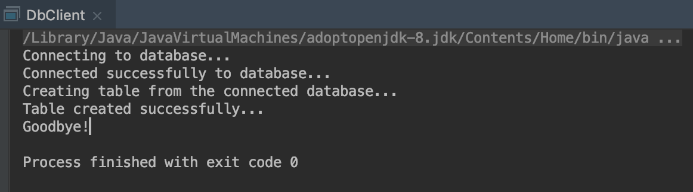
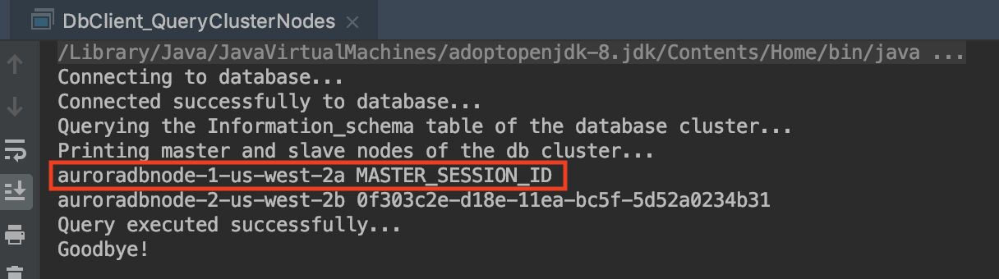
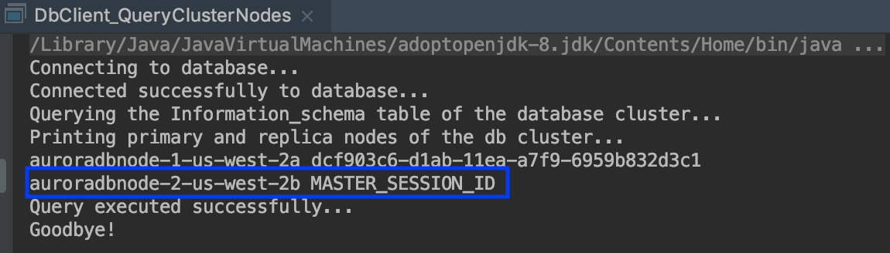
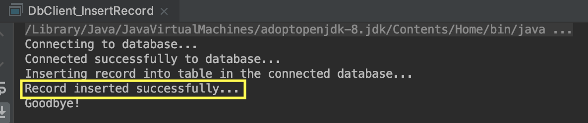

# Using the MariaDB JDBC driver with Amazon Aurora with MySQL compatibility
Use the MariaDB JDBC driver, known as MariaDB Connector/J, to connect to an [Amazon Aurora](https://aws.amazon.com/rds/aurora/) cluster. We demonstrate how the automatic failover capability of the connector allows switching rapidly and seamlessly between master and replica in a failover situation. You can have a quick read through of the following [blog post](https://aws.amazon.com/blogs/database/using-the-mariadb-jdbc-driver-with-amazon-aurora-with-mysql-compatibility/) if you do not wish to complete the lab.

## Learning objectives
In this lab you will learn the following:

- Create an Amazon Aurora database cluster using AWS CLI
- Create a database instance 
- Create secrets using AWS Secrets Manager to securely access the database instance 
- Create a java application to connect to the database instance using the MariaDB JDBC driver also known as MariaDB Connector/J
- Test the MariaDB Connector/J failover capability with Aurora automatic failover

## Prerequisites

- A valid and active AWS account
- AWS CLI. See [nstalling](https://docs.aws.amazon.com/cli/latest/userguide/cli-chap-install.html) and [configuring](https://docs.aws.amazon.com/cli/latest/userguide/cli-chap-configure.html) the AWS CLI
- MySQL client to connect to the Amazon Aurora cluster from a terminal. For this lab I am using a terminal on my Mac machine. Please find instructions  for installing mysql client on your terminal [here](https://pypi.org/project/mysqlclient/)
- [MariaDB Connector/J](https://downloads.mariadb.org/connector-java/)
- An IDE. Using IntelliJ IDEA for this lab

## Create an Amazon Aurora cluster

For this lab we will use AWS CLI command below to create our demo Amazon Aurora cluster. You can also follow the steps for creating an Amazon Aurora cluster from AWS console [here](https://docs.aws.amazon.com/AmazonRDS/latest/AuroraUserGuide/Aurora.CreateInstance.html)

	aws rds create-db-cluster --db-cluster-identifier auroradbcluster --engine aurora-mysql --engine-version 5.7.12 --master-username username --master-user-password ###### --db-subnet-group-name mysubnetgroup --vpc-security-group-ids sg-xxxxx

Remember to replace the <sg-xxxx> with your vpc security group id in the above command.

Add an inbound rule to the security group of your database cluster to allow connection from your terminal using the following command.

	aws ec2 authorize-security-group-ingress --group-name <your security group name> --protocol tcp --port 3306 --cidr <your terminal IP address>

## Create database instance 
Open the terminal and run the following command to connect to the Amazon Aurora db cluster:

	mysql -u admin -h auroradbcluster.cluster-c9di9qmu8xqw.us-east-1.rds.amazonaws.com -p
	Enter password: 
	Welcome to the MariaDB monitor.  Commands end with ; or \g.
	Your MySQL connection id is 880
	Server version: 5.7.12 MySQL Community Server (GPL)
	
	Copyright (c) 2000, 2018, Oracle, MariaDB Corporation Ab and others.
	
	Type 'help;' or '\h' for help. Type '\c' to clear the current input statement.

Once you're connected to the dabatase, run the following command to create a new db instance
	
	MySQL [(none)]> create database auroradbtest;
	
## Create database secrets
We will use AWS Secrets Manager to create the needed secrets that would allow our java program to connect securely to the database. The secrets can be created using the [AWS console or the CLI](https://docs.aws.amazon.com/secretsmanager/latest/userguide/manage_create-basic-secret.html). For this lab, we will use the AWS CLI command below.

	aws secretsmanager create-secret --name db-blog --description "using the mariadb driver with aurora mysql" --secret-string file://db-blog.json

## Use a Java program to connect to an Aurora MySQL instance

The code for our java client program can be found under code/src/main/java/com.amazonaws.mariadbblog/DbClient.java

Note that the dependency below needs to be added to the code/pom.xml file to enable the java program to connect to Aurora instance using the mariadb JDBC driver (Connector/J)

        <dependency>
            <groupId>org.mariadb.jdbc</groupId>
            <artifactId>mariadb-java-client</artifactId>
            <version>2.6.0</version>
        </dependency>

Use the code in the file DbClient.java to connect to Aurora MySQL and run a query to create a VENDORS table in the auroradbtest database.

If we run the DbClient.java program from our chosen IDE, we can see from the screenshot below that we are able to connect to the database. 

We have just demonstrated how to use the MariaDB JDBC driver known as MariaDB Connector/J to connect to an Amazon Aurora with MySQL compatibility DB using a Java client app.

## Working with failover

In the second part of this demo, we demonstrate how the MariaDB Connector/J failover capability works with Aurora automatic failover.

To do that, use the DbClient_QueryClusterNodes.java which is a modified version of the DbClient.java that connects to the database cluster and runs a query to read from the INFORMATION_SCHEMA table the endpoint (master or replica) to which the current connection is pointing to. As we can see from the screenshot below the current primary node (master) is auroradbnode-1-us-west-2a

Now let’s try to run a query to inserting a record on the database. To better illustrate the failover scenario, we connect to each node endpoint separately and run queries to try adding data to the VENDORS table. That way, we can show that we can’t insert data to the database while connected to the replica endpoint because it has read-only permissions.

### Connecting to the master endpoint

This time we use mysql client from a terminal to connect to the master node of our database. The same can also be done with the java client program.

	mysql -u auroradbtest -h auroradbnode-1-us-west-2a.cgdued2pbbld.us-west-2.rds.amazonaws.com -p
	Enter password: 
	Welcome to the MySQL monitor.  Commands end with ; or \g.
	Your MySQL connection id is 727502
	Server version: 5.7.12 MySQL Community Server (GPL)
	
	Copyright (c) 2000, 2019, Oracle and/or its affiliates. All rights reserved.
	
	Oracle is a registered trademark of Oracle Corporation and/or its
	affiliates. Other names may be trademarks of their respective
	owners.
	
	Type 'help;' or '\h' for help. Type '\c' to clear the current input statement.
	
	mysql> use auroradbtest;
	Reading table information for completion of table and column names
	You can turn off this feature to get a quicker startup with -A
	
	Database changed
	mysql> select * from VENDORS;
	Empty set (0.23 sec)
	
	mysql> INSERT INTO VENDORS (id, name, CEO, VAT_Number) VALUES (1, 'AWS', 'Andy Jassy', 11111);
	Query OK, 1 row affected (0.21 sec)
	
	mysql> select * from VENDORS;
	+----+------+------------+------------+
	| id | name | CEO        | VAT_Number |
	+----+------+------------+------------+
	|  1 | AWS  | Andy Jassy |      11111 |
	+----+------+------------+------------+
	1 row in set (0.30 sec)
	
	mysql> 

### Connecting to the replica node

	(base) 38f9d3e33f20:code gleschen$  mysql -u auroradbtest -h auroradbnode-2-us-west-2b.cgdued2pbbld.us-west-2.rds.amazonaws.com -p
	Enter password: 
	Welcome to the MySQL monitor.  Commands end with ; or \g.
	Your MySQL connection id is 354190
	Server version: 5.7.12 MySQL Community Server (GPL)
	
	Copyright (c) 2000, 2019, Oracle and/or its affiliates. All rights reserved.
	
	Oracle is a registered trademark of Oracle Corporation and/or its
	affiliates. Other names may be trademarks of their respective
	owners.
	
	Type 'help;' or '\h' for help. Type '\c' to clear the current input statement.
	
	mysql> use auroradbtest
	Reading table information for completion of table and column names
	You can turn off this feature to get a quicker startup with -A
	
	Database changed
	mysql> select * from VENDORS;
	+----+------+------------+------------+
	| id | name | CEO        | VAT_Number |
	+----+------+------------+------------+
	|  1 | AWS  | Andy Jassy |      11111 |
	+----+------+------------+------------+
	1 row in set (0.26 sec)
	
	mysql> INSERT INTO VENDORS (id, name, CEO, VAT_Number) VALUES (2, 'Microsoft', 'Satya Nadella', 22222);
	ERROR 1290 (HY000): The MySQL server is running with the --read-only option so it cannot execute this statement
	mysql>

Now let's force a failover by changing the role of the replica from reader to writer. This can be done from the AWS console or from the CLI. For this lab, we use the CLI with the following command

	aws rds failover-db-cluster --db-cluster-identifier auroradbcluster-us-west-2 --target-db-instance-identifier auroradbnode-2-us-west-2b
	
On running the command it return the following output:

	{
	    "DBCluster": {
	        "AllocatedStorage": 1,
	        "AvailabilityZones": [
	            "us-west-2c",
	            "us-west-2a",
	            "us-west-2b"
	        ],
	        "BackupRetentionPeriod": 1,
	        "DatabaseName": "auroradbtest",
	        "DBClusterIdentifier": "auroradbcluster-us-west-2",
	        "DBClusterParameterGroup": "default.aurora-mysql5.7",
	        "DBSubnetGroup": "awseb-e-4bqpb2izki-stack-awsebrdsdbsubnetgroup-mrm750xsz1y4",
	        "Status": "available",
	        "EarliestRestorableTime": "2020-07-27T11:36:16.714Z",
	        "Endpoint": "auroradbcluster-us-west-2.cluster-cgdued2pbbld.us-west-2.rds.amazonaws.com",
	        "ReaderEndpoint": "auroradbcluster-us-west-2.cluster-ro-cgdued2pbbld.us-west-2.rds.amazonaws.com",
	        "MultiAZ": true,
	        "Engine": "aurora-mysql",
	        "EngineVersion": "5.7.12",
	        "LatestRestorableTime": "2020-07-28T23:54:50.921Z",
	        "Port": 3306,
	        "MasterUsername": "xxxxxxxx",
	        "PreferredBackupWindow": "11:28-11:58",
	        "PreferredMaintenanceWindow": "sat:12:16-sat:12:46",
	        "ReadReplicaIdentifiers": [],
	        "DBClusterMembers": [
	            {
	                "DBInstanceIdentifier": "auroradbnode-2-us-west-2b",
	                "IsClusterWriter": false,
	                "DBClusterParameterGroupStatus": "pending-reboot",
	                "PromotionTier": 1
	            },
	            {
	                "DBInstanceIdentifier": "auroradbnode-1-us-west-2a",
	                "IsClusterWriter": true,
	                "DBClusterParameterGroupStatus": "in-sync",
	                "PromotionTier": 1
	            }
	        ],
	        "VpcSecurityGroups": [
	            {
	                "VpcSecurityGroupId": "sg-0bcdadbbd64013e6b",
	                "Status": "active"
	            }
	        ],
	        "HostedZoneId": "Z1PVIF0B656C1W",
	        "StorageEncrypted": true,
	        "KmsKeyId": "arn:aws:kms:us-west-2:xxxxxxx:key/b286e412-6b05-40f2-9923-6dcbb3f57c48",
	        "DbClusterResourceId": "cluster-KIG64YBWUMRXD3UJJJZUPNRUGA",
	        "DBClusterArn": "arn:aws:rds:us-west-2:xxxxxxx:cluster:auroradbcluster-us-west-2",
	        "AssociatedRoles": [],
	        "IAMDatabaseAuthenticationEnabled": false,
	        "ClusterCreateTime": "2019-01-23T16:21:57.573Z",
	        "EngineMode": "provisioned",
	        "DeletionProtection": false,
	        "HttpEndpointEnabled": false,
	        "CopyTagsToSnapshot": false,
	        "CrossAccountClone": false,
	        "DomainMemberships": []
	    }
	}

If we re-run our java client program DbClient_QueryClusterNodes.java again we can see that the previous master node (auroradbnode-2-us-west-2a)is now a replica while the previous replica (auroradbnode-2-us-west-2b) has been promoted to master. See screenshot below.

Similarly, if we rerun the insert query to add data to the VENDORS table while connected to the previous replica endpoint which has now been promoted to master, we are able to successfully add record to the table as shown from the output below.

	mysql -u auroradbtest -h auroradbnode-2-us-west-2b.cgdued2pbbld.us-west-2.rds.amazonaws.com -p
	Enter password: 
	Welcome to the MySQL monitor.  Commands end with ; or \g.
	Your MySQL connection id is 68
	Server version: 5.7.12 MySQL Community Server (GPL)
	
	Copyright (c) 2000, 2019, Oracle and/or its affiliates. All rights reserved.
	
	Oracle is a registered trademark of Oracle Corporation and/or its
	affiliates. Other names may be trademarks of their respective
	owners.
	
	Type 'help;' or '\h' for help. Type '\c' to clear the current input statement.
	
	mysql> use auroradbtest;
	Reading table information for completion of table and column names
	You can turn off this feature to get a quicker startup with -A
	
	Database changed
	mysql> INSERT INTO VENDORS (id, name, CEO, VAT_Number) VALUES (3, 'Salesforce', 'Mark Benioff', 33333);
	Query OK, 1 row affected (0.26 sec)
	
	mysql> select * from VENDORS;
	+----+------------+--------------+------------+
	| id | name       | CEO          | VAT_Number |
	+----+------------+--------------+------------+
	|  1 | AWS        | Andy Jassy   |      11111 |
	|  3 | Salesforce | Mark Benioff |      33333 |
	+----+------------+--------------+------------+
	2 rows in set (0.22 sec)
	
	mysql> 

In the same way, if we connect to the replica and try to run an INSERT query, we get an error as shown in the output below.

	mysql -u auroradbtest -h auroradbnode-1-us-west-2a.cgdued2pbbld.us-west-2.rds.amazonaws.com -p
	Enter password: 
	Welcome to the MySQL monitor.  Commands end with ; or \g.
	Your MySQL connection id is 32
	Server version: 5.7.12 MySQL Community Server (GPL)
	
	Copyright (c) 2000, 2019, Oracle and/or its affiliates. All rights reserved.
	
	Oracle is a registered trademark of Oracle Corporation and/or its
	affiliates. Other names may be trademarks of their respective
	owners.
	
	Type 'help;' or '\h' for help. Type '\c' to clear the current input statement.
	
	mysql> use auroradbtest;
	Reading table information for completion of table and column names
	You can turn off this feature to get a quicker startup with -A
	
	Database changed
	mysql> INSERT INTO VENDORS (id, name, CEO, VAT_Number) VALUES (2, 'Amazon', 'Jeff Bezos', 22222);
	ERROR 1290 (HY000): The MySQL server is running with the --read-only option so it cannot execute this statement
	mysql> 

Finally, let's use our java client program DbClient_InsertRecord to connect to the cluster and insert a record to a table. As shown on the screenshot below, the program execute successfully

We can see that the record has been inserted to the table from the terminal.

	mysql> select * from VENDORS;
	+----+------------+--------------+------------+
	| id | name       | CEO          | VAT_Number |
	+----+------------+--------------+------------+
	|  1 | AWS        | Andy Jassy   |      11111 |
	|  2 | Amazon     | Jeff Bezos   |      22222 |
	|  3 | Salesforce | Mark Benioff |      33333 |
	+----+------------+--------------+------------+
	3 rows in set (0.24 sec)

## Summary

In this lab we demonstrated how to use the MariaDB JDBC driver to connect to Amazon Aurora with MySQL compatibility. The scenario used in this lab helped showcase how to make the best use of the MariaDB JDBC driver also known as Connector/J and take advantage of its fast and seamless failover capabilities.

## License
This project is licensed under the MIT-0 License.

